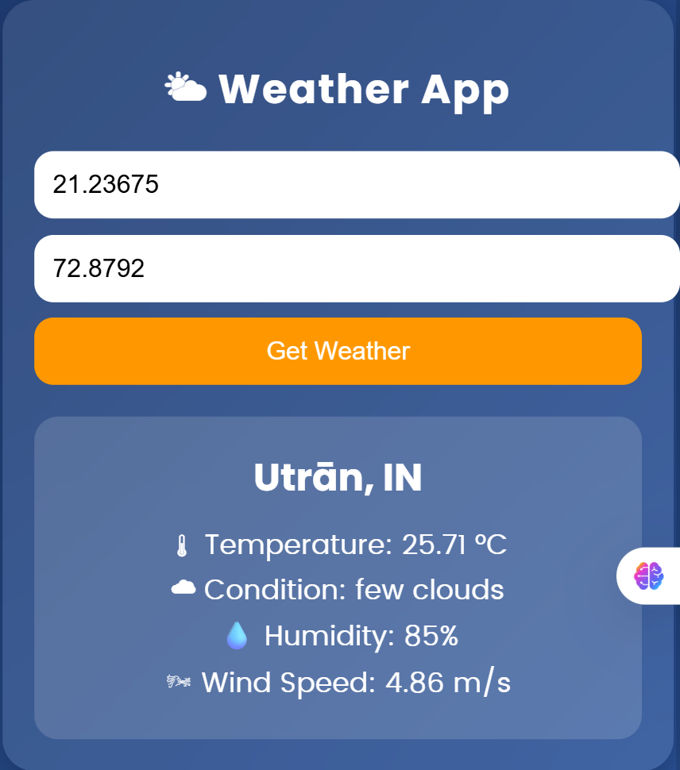
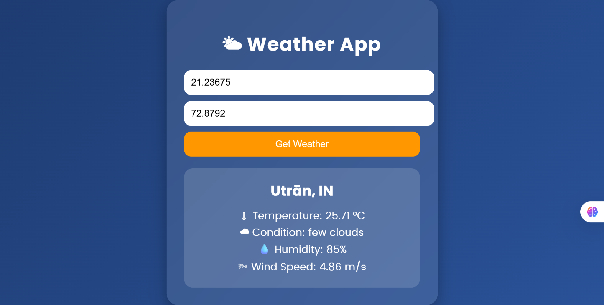

A simple and responsive **Weather App** built with **HTML, CSS, and JavaScript**.  
It allows users to fetch real-time weather details by entering **latitude** and **longitude**, using the [OpenWeatherMap API](https://openweathermap.org/).

---

## 🚀 Features
- 🌡 Get live **temperature** in °C  
- ☁ Shows **weather condition** (e.g., clear sky, rain, etc.)  
- 💧 Displays **humidity**  
- 🌬 Shows **wind speed**  
- 📍 Works with any **latitude & longitude** coordinates  
- 🎨 Modern responsive **UI with gradient & glassmorphism effect**

---

## 🖼 Preview





*(Add your screenshot as `screenshot.png` in the project folder for display here.)*

---

## 🛠️ Technologies Used
- **HTML5** – Structure of the app  
- **CSS3** – Styling with gradient background & responsive design  
- **JavaScript (ES6+)** – Fetch API for data from OpenWeatherMap  
- **OpenWeatherMap API** – Source of real-time weather data  

---

## 📂 Project Structure
📁 Weather-App
┣ 📄 index.html
┣ 📄 README.md
┗ 📄 screenshot.png (optional)

yaml
Copy code

---

## ⚙️ How to Run
1. Clone or download this repository.  
2. Open `index.html` in your browser.  
3. Enter **Latitude** & **Longitude** values.  
4. Click **"Get Weather"** to see the live weather details.  

---

## 🔑 API Key Setup
This project uses **OpenWeatherMap API**.  
You can get your own API key by signing up at:  
👉 https://home.openweathermap.org/users/sign_up  

In `index.html`, replace the default key with your own:
```javascript
const apiKey = "YOUR_API_KEY_HERE";
📌 Example Coordinates
Surat, India → Lat: 21.1702, Lon: 72.8311

London, UK → Lat: 51.5072, Lon: -0.1276

New York, USA → Lat: 40.7128, Lon: -74.0060

🧑‍💻 Author
Kripalsinh Gohil
📧 Email: kripalsinh132004@gmail.com
📱 Mobile: +91 63553 58991
